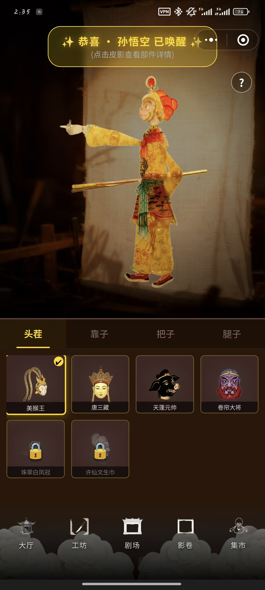
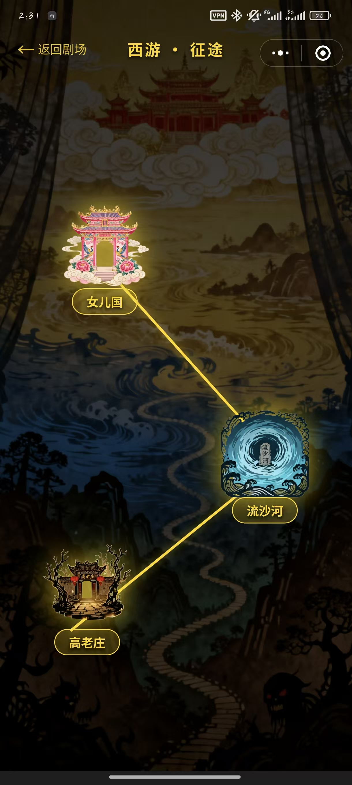
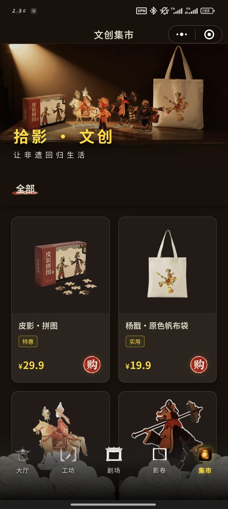
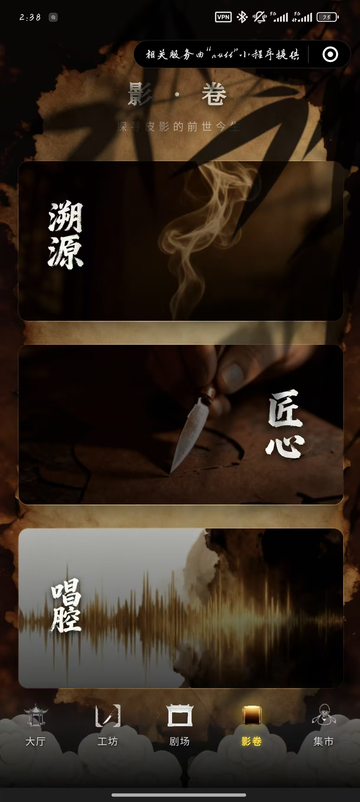
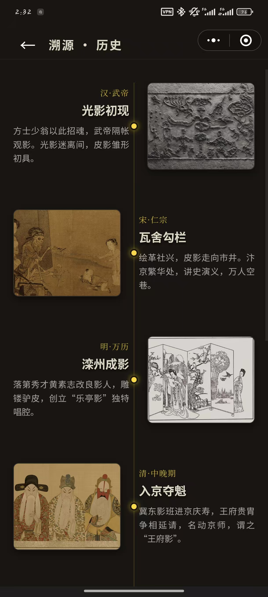
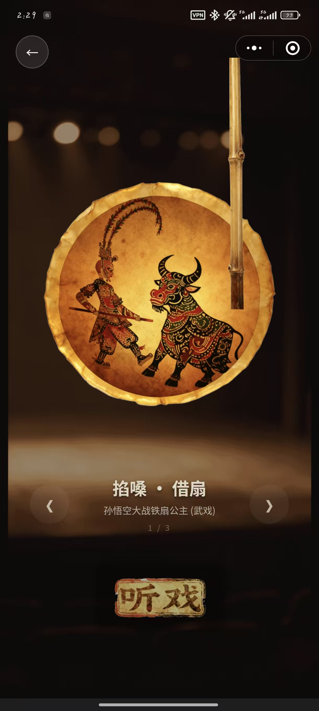

# 云上·皮影 Cloud Shadow

基于 Uni-app + Vue 3 的非遗皮影文化沉浸式小程序原型，围绕“看见皮影、了解皮影、参与皮影、带走皮影”的体验链路，设计了文化百科、每日日签、互动剧场、皮影工坊和文创集市等模块。

> 本项目为 2026 年“挑战杯”参赛作品。项目原计划以小程序形态公开展示，但由于个人主体暂不具备文化类小程序上线资质，最终未公开发布。当前仓库主要用于作品展示、代码留存和后续迭代。

## 项目截图

<table>
  <tr>
    <td align="center"><br />皮影工坊</td>
    <td align="center"><br />西游征途</td>
    <td align="center"><br />文创集市</td>
  </tr>
  <tr>
    <td align="center"><br />影卷百科</td>
    <td align="center"><br />溯源历史</td>
    <td align="center"><br />听戏互动</td>
  </tr>
</table>

## 项目亮点

- 以皮影戏舞台作为主视觉，使用云端图片、GIF、帷幕、光影和背景音乐构建沉浸式入口。
- 将非遗知识拆成“历史溯源、制作工艺、唱腔特色”等可浏览卡片，降低文化内容的阅读门槛。
- 设计“西游·征途”互动剧场，用闯关、剧情对话、触控小游戏和奖励解锁连接传统故事与小程序交互。
- 通过“皮影工坊”把角色拆解为头茬、靠子、把子、腿子，模拟皮影部件收集、组装、唤醒和结构拆解过程。
- 以“拾影·日签”和“文创集市”延展日常触点，让非遗内容从知识展示走向生活化表达。

## 功能模块

### 加载页

加载页以西游队伍行进 GIF、进度条和文案提示作为开场，完成后进入主大厅，强化“好戏开场”的仪式感。

### 主大厅

主大厅采用舞台背景、帷幕前景、皮影动画和背景音乐控制组件，作为整个小程序的视觉入口，并提供“拾影·日签”等功能入口。

### 影卷百科

影卷模块包含皮影文化内容入口：

- 溯源·历史
- 匠心·工艺
- 唱腔·特色

页面通过卷轴感卡片、深色背景和装饰性竹影，呈现传统文化资料的浏览体验。

### 拾影·日签

日签模块根据日期展示不同皮影素材、诗句和宜忌式文案，使用纸张纹理、印章水印和收藏按钮模拟“每日一签”的文化卡片体验。

### 指尖剧场

剧场模块以剧本卡片轮播形式展示可进入的剧目，包括：

- 西游记：已接入“西游·征途”关卡地图
- 白蛇传：保留筹备状态
- 敬请期待：锁定状态

进入剧场时会暂停全局背景音乐，退出后恢复，避免与剧场体验冲突。

### 西游·征途

“西游·征途”是互动关卡地图，包含三个连续关卡：

- 高老庄：擦除迷雾，发现猪八戒
- 流沙河：点击气泡，收集沙僧法宝
- 女儿国：拖拽元神，帮助唐僧归位

通关状态会写入本地存储，用于解锁后续关卡和工坊部件奖励。

### 皮影工坊

工坊模块是项目的核心互动玩法之一。用户可以在部件栏中选择不同角色的：

- 头茬
- 靠子
- 把子
- 腿子

当同一角色四类部件集齐后，会触发“灵韵合一”合成动效，唤醒完整皮影形态。唤醒后还可以切换结构拆解视图，观察皮影部件组成。

### 文创集市

文创集市展示皮影主题文创商品，如拼图、帆布袋、透光立牌等。当前为参赛演示项目，未接入真实支付系统，点击购买会弹出说明弹窗。

## 技术栈

- Uni-app
- Vue 3
- Vite
- SCSS / CSS Animation
- Pinia
- 微信小程序构建目标
- 云端静态资源：腾讯云 CloudBase 静态资源链接

## 目录结构

```text
.
├── src
│   ├── App.vue
│   ├── main.js
│   ├── manifest.json
│   ├── pages.json
│   ├── components
│   │   ├── CustomTabBar.vue
│   │   └── MusicControl.vue
│   ├── pages
│   │   ├── loading
│   │   ├── index
│   │   ├── wiki
│   │   ├── daily
│   │   ├── theater
│   │   ├── workshop
│   │   ├── market
│   │   └── profile
│   ├── stores
│   ├── static
│   └── utils
├── package.json
├── vite.config.js
└── README.md
```

## 本地运行

安装依赖：

```bash
npm install
```

启动 H5 预览：

```bash
npm run dev:h5
```

启动微信小程序构建：

```bash
npm run dev:mp-weixin
```

构建微信小程序产物：

```bash
npm run build:mp-weixin
```

如果使用微信开发者工具预览，需要将构建产物导入开发者工具，并根据本地环境补充小程序 AppID 等配置。

## 项目状态

当前仓库保留的是一个较完整的小程序原型，核心页面和交互链路已经实现，但仍有一些后续可完善方向：

- 补充真实项目截图、录屏或 GIF 演示。
- 整理素材版权来源和授权说明。
- 优化部分静态资源命名和本地备份方式。
- 根据实际上线平台补充 AppID、云开发环境和发布配置。
- 如果未来具备文化类小程序上线资质，可继续完善审核材料与内容合规说明。

## 素材说明

项目中大量图片、GIF、音频资源通过云端静态链接加载，主要用于参赛演示和作品集展示。若进行公开发布或商业使用，需要进一步核对素材来源、授权范围和非遗文化内容使用边界。

## 协作说明

项目开发过程中使用了 AI 辅助工具参与部分代码生成、视觉方案探索和交互实现，最终功能整合、产品取舍和项目表达由开发者完成。
